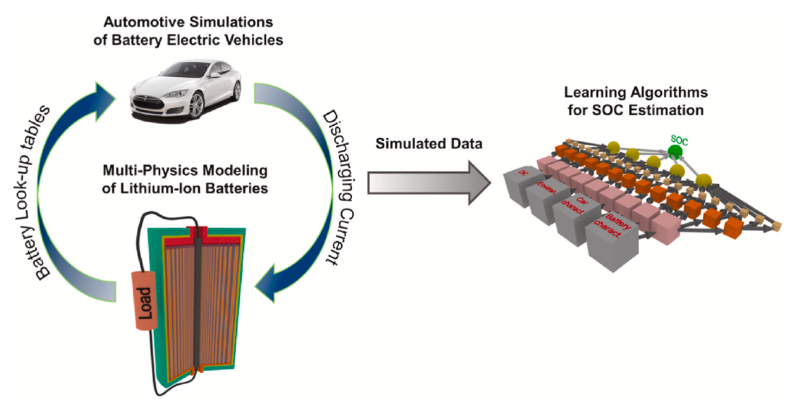

# Machine-Learning-Battery-SOC-Estimaton-Electric-Vehicles


This repository contains the codes to implement a data driven framework to predict the state-of-charge (SOC) of Lithium-Ion Batteries in Electric Vehicles applications. The codes provided in this repository have been developed as part of a project about Machine Learning applied to Lithium-Ion Batteries research at the University of Illinois at Chicago. The results illustrated in this repository have contributed to the paper "Data driven estimation of electric vehicle battery state-of-charge informed by automotive simulations and multi-physics modeling" published in the Journal of Powe Sources in 2020. 

We have been also invited to present the project at the ***PRiME 2020 ECS Meeting*** in the symposium *F03:  Modeling Electrochemical Systems for Transportation Applications*

If you are intended to use our code, please cite:

***Ragone M.***,*Yurkiv V.,Ramasubramanian A.,Kashir B.,Mashayek F.,Datadrivenestimationofelectricvehiclebatterystate-of-charge informed by automotive simulations and multi-physics modeling, Journal of Power Sources, 483 (2021) 229108*





# How to use it
## 1. Installation

**Matlab Installation**

Install MATLAB & Simulink version 2019 or above

https://www.mathworks.com/products/matlab.html

**Python Installtion**

Install Python 3.7 in Anaconda 

https://www.anaconda.com/

**Required Python packages**

**Pandas**:
```yaml
conda install -c anaconda pandas
```
**Scikit-Learn**:

```yaml
conda install -c conda-forge scikit-learn 
```

**Tensorflow 2.2.0**:
```yaml
pip3 install tensorflow==2.2.0
```

## 2. Matlab codes-Electric Vehicle Simulation

Matlab and Simulink are used to perform Electric Vehicle simulation. The dynamic EV model is built in Simulink usig the Power Train Blockset modules, which allows to simulate the component of the vehicles such as the battery pack, the electric motor, the differential etc. through appropriate blocks parametrized using lookup tables. In order to create the lookup tables needed by the Simulink EV model we need to run Matlab scripts. The scripts are implemented for two EV, TeslaS and Nissan Leaf. The EV simulations are necessary to simulated the time series of the electro-mechanical variables used to train and test Machine Learning models to predict the State-Of-Charfe in electric vehicles applications.

### 2.1 Battery Parametrization
One of the main difference between these two vehicles is the battery pack. **TeslaS** has a battery pack of **8256 cylindrical cells**, managed in a **96s86p series/parallel connection**. A single cell is characterized by a **C-NMC chemistry** (anode material: Carbon,  cathode material: Nickel-Manganese-Cobalt) and it has a nominal capacity of 2.86 Ah and a nominal voltage of 4.2 V, resulting in a total capacity of 246 Ah and total energy of 100 kWh. This type of battery allows TeslaS to achieve **a driving range of ~600 km** before recharging the battery.

On the other hand, **Nissan Leaf** has a battery pack of **288 pouch cells**, managed in a **96s3p series/parallel connection**. A single cell is characterized by a **C-LMO chemistry** (anode material: Carbon,  cathode material: Lithium-Manganese-Oxygen) and it has a nominal capacity of 56.3 Ah and a nominal voltage of 4.2 V, resulting in a total capacity of 169 Ah and total energy of 62 kWh. This type of battery allows TeslaS to achieve **a driving range of ~363 km** before recharging the battery.

These information are implemented in the EV model, through an appropriate parametrization of the battery module. The parametrization is built on top of dishcarge curves at constant C-rate at different temperatures and constant temperature at different C-rates, computed with a P2D model in COMSOL Multiphysics and saved in txt files. There scripts to perform the parametrization are in the folders **parametrization_steps_TeslaS** and **parametrization_steps_NissanLeaf**. The script *battery_parametrization.m* allows to run all of them in one shot. Please run in Matlab:


```yaml
battery_parametrization.m
```

In the script you can specify wich EV you want to model by setting the path to the TeslaS and Nissan Leaf parametrization. The TeslaS parametrization points to the directory **parametrization_steps_TeslaS** while the Nissan Leaf parametrization points to the directory **parametrization_steps_NissanLeaf**


### 2.2 Powertrain System Parameters
Not only the battery pack needs to be parametrized, but all the other modules which characterize the electro-mechanical blocks of the EV model. You can define the input parameters for the electro-chemical modules by running:

```yaml
TeslaS_input_data.m
```
for TeslaS, and: 

```yaml
NissanLeaf_input_data.m
```

for Nissan Leaf.

### 2.3 Driving Cycles

The input to the EV model is a driving cycle, which an applied speed profile over time. Practically speaking, we are forcing our EV to drive with our applied speed profile defined by the driving cycle. A driving cycle is available from public agencies such as the **Environmental Protection Agency (EPA)**, which perform tests to evaluate for example the emissions of vehicles in different conditions (urban, extra-urba, highway, high speed, low speed  etc.). Please refer to the driving cycles EPA webpage: https://www.epa.gov/vehicle-and-fuel-emissions-testing/dynamometer-drive-schedules.

The folder **driving_cycles** contain subfolders corresponding to driving cycles from different sources. The driving cycles are saved in txt files. In the provided example, the EPA FTP75 is considered. To define the driving cycle, please run the script *driving_cycle*:

```yaml
driving_cycle.m
```
It should be noted that the driving cycle in the txt files should be applied with repetition to the EV model, because a single cycle does not dishcarge the battery in full. For this reason, it is necessary to repeat the driving cycle for a sufficiently high number of repetitions. An option could be to set a number of repetitions corresponding to the driving range of the EV. In this case, the number of repetition is simply the driving range divided by the distance covered by a single cycle. 

The number of repetitions is set by the parameter **n_repeat**. It should be noted that a high number of repetition results in a longer time to complete the simulation, so if you just want to test the model, you can set this parameter to 1. Off course a single cycle corresponds to a tiny discharge of the battery, ~2%.

### 2.4 EV model


The EV Simulink model is implemented in the file *EV_model.slx*. You just need to open it by clicking on it and then press the green button in the upper taksbar. During the simulation you can open the scopes to visualize the time series variations of different variables such as the SOC, the voltage, the current, the electric motor power etc.

### 2.5 Save the results
The scripts *save_results_TeslaS.m* and *save_results_NissanLeaf.m* save the time series of the electro-mechanical variables for TeslaS and Nissan Leaf in a single dataset, one for the variables in form of power variation and one in form of energy variation. The discharging current is also saved separately. The datasets are saved in csv files, located in the folders **results_TeslaS** and **results_NissanLeaf** created by the script. Please run:

```yaml
save_results_TeslaS.m
```
for TeslaS, and: 

```yaml
save_results_NissanLeaf.m
```

for Nissan Leaf.

The datasets saved in the csv files will be used for **Machine Learning** calculations, while the current saved in the txt file will be used for 3D battery simulation in **COMSOL Multiphysics**.

### 2.6 Plot the results

Finally, if you run the script *plot_results.m* you can plot the time series of the battery SOC, voltage (cell/battery pack) and current (cell/battery pacj). Please run:

```yaml
plot_results.m
```

